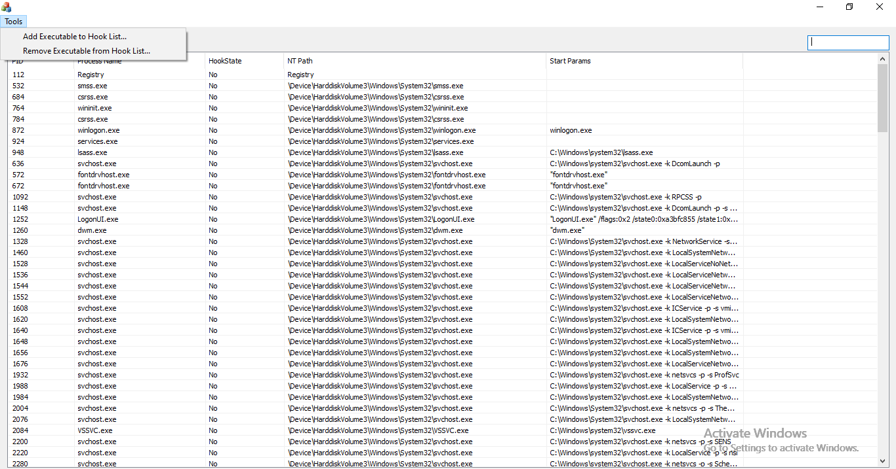

# Attention

## Force Injection Feature Limitation

for now, we won't inject into protected process, beyond that, some Windows system process can not be injected through force injection, either

such as `fontdrvhost.exe`, these kind of processes won't accept dlls out of [KnownDLLs](https://www.elastic.co/jp/blog/detect-block-unknown-knowndlls-windows-acl-hardening-attacks-cache-poisoning-escalation) (trusted by Windows PE Loader), you will get [0xC0000022](https://learn.microsoft.com/en-us/openspecs/windows_protocols/ms-erref/596a1078-e883-4972-9bbc-49e60bebca55) (STATUS_ACCESS_DENIED) when calling `ntdll!LdrpGetNtPathFromDosPath`

