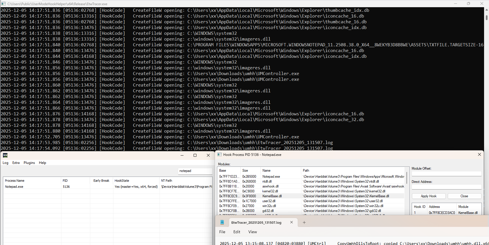


**special thanks to these great open source projects:**

- [injdrv](https://github.com/wbenny/injdrv)
- [capstone](https://github.com/capstone-engine/capstone)
- [ProcessHacker](https://sourceforge.net/projects/processhacker/)

**驱动使用的是测试签名，需要开启测试模式，不然无法加载**

```c
bcdedit /set testsigning on
shutdown /g /t 1 /f
```

**本工具使用inline hook，因此hook点位至少需要有6字节才能进行hook**

# 更新

## 2025-12-26

增加hooksequence文件支持，可批量hook

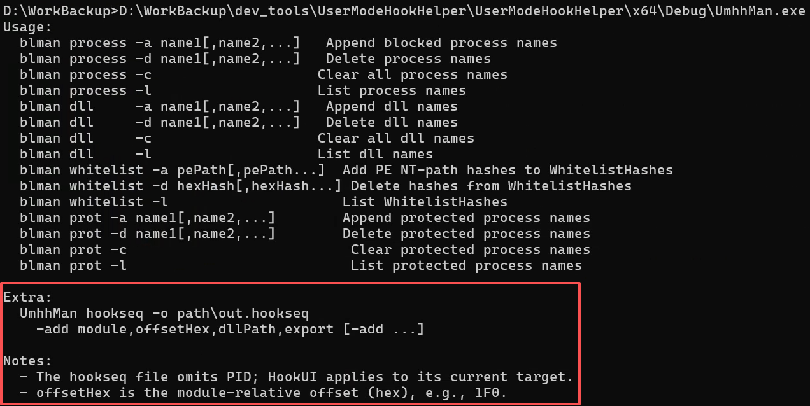

```cmd
UmhhMan.exe hookseq -o C:\users\public\driver.hookseq -add ntoskrnl.exe,60b820,C:\Users\Public\driver\DriverHookCodeTemplate.sys,HookCodeX64
```


<hr>

增加[KernelModeHookHelper](https://github.com/wqreytuk/UserModeHookHelper/tree/main/plugins/KrnlModeHookHlp)插件

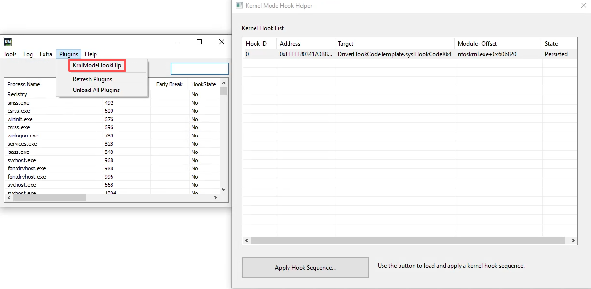

# 基本用法

选中要hook的进程，右键选择Force Inject

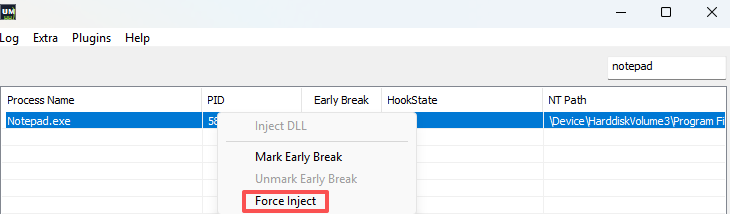

注入成功之后双击打开Hook引导窗口

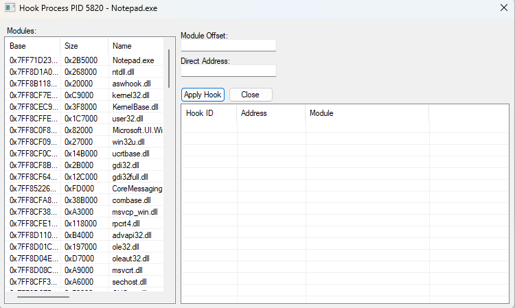

左侧为module list，右侧为hook地址输入栏和hook list

hook地址输入方式有两种：

- 先在左侧选中要hook的模块，然后在Module Offset输入框中输入hook地址在该模块的偏移量

- 在Direct Address输入框中直接输入hook地址

点击Apply Hook按钮会弹出文件选择框，选择包含你自己编写的包含[hook代码逻辑的dll](https://github.com/wqreytuk/UserModeHookHelper/tree/main/hook_component/HookCodeTemplate)文件即可

在[release](https://github.com/wqreytuk/UMHH_Release)中，我们附带了两个用于演示的dll：[HookCodeTemplate.x64.dll](https://github.com/wqreytuk/UMHH_Release/blob/main/HookCodeTemplate.x64.dll)和[HookCodeTemplate.Win32.dll](https://github.com/wqreytuk/UMHH_Release/blob/main/HookCodeTemplate.Win32.dll)，分别用于X64和x86进程的hook

hook成功后会出现在hooklist列表中

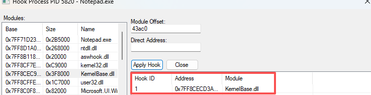

在hooklist中选中之后右键有四个菜单，菜单名字就是他的功能含义，不用再作解释

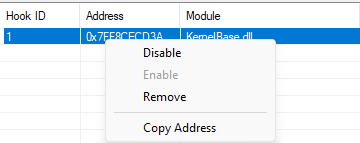

此时我们已经hook了`Notepad.exe`进程的`Kernelbase!CreateFileW`函数，只要Notepad进行打开文件的操作，我们就能从[EtwTracer](https://github.com/wqreytuk/UMHH_Release/blob/main/EtwTracer.exe)中看到日志记录

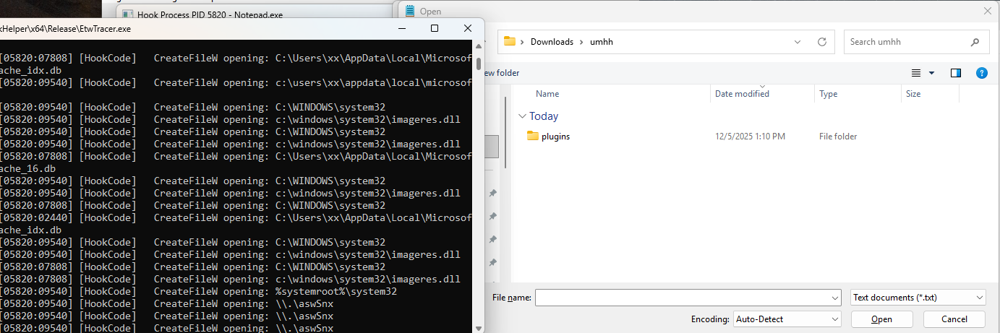


# Early Break

在调试受保护进程时，我们有时候想要在程序早期启动阶段断下来以调试启动阶段的代码

对于这种需求，可以通过我们的early break功能来实现

比如，我们想要在avp.exe启动的时候断下来，只需要选中之后右键点击Mark Early Break

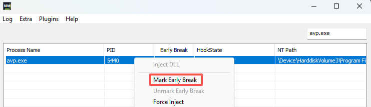

如果此时未开启全局注入，程序会提示你启用全局注入选项

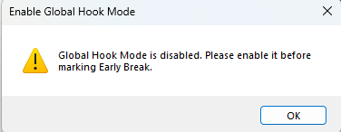

全局注入开启之后，所有新启动的进程都会被注入Master DLL（相当于我们工具的一个agent）

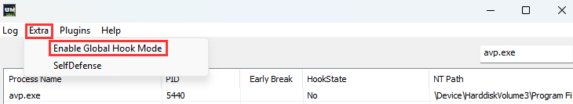

开启之后再次点击Mark Early Break即可，标记之后，这里会出现一个记号

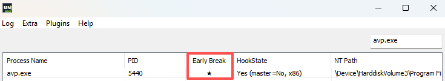

然后我们重启电脑，我们的Masert DLL(agent)会在目标进程启动初期注入并触发INT 3断点

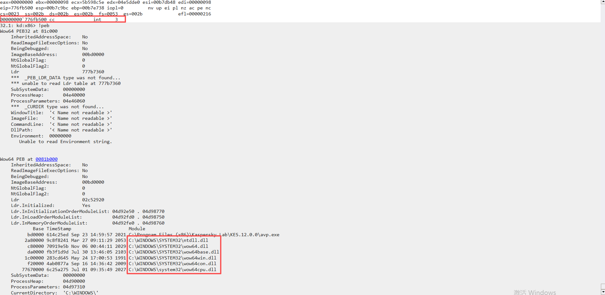

可以看到此时目标程序仅加载了必要的一些系统函数，自己本身的dll还未加载

# 插件支持

参考[AVProcessHandleLocater](https://github.com/wqreytuk/UserModeHookHelper/tree/main/plugins/AVProcessHandleLocater)

该插件可以搜索当前系统中可以获取目标进程高权限句柄的进程


# UmhhMananager

[UmhhMan](https://github.com/wqreytuk/UserModeHookHelper/tree/main/controller/UmhhManager)是一个cli工具，用于管理本工具中的驱动中的一些注册表项，主要有以下四个功能

- 受保护进程ProcessName管理
- 白名单进程路径NTPath Hash管理
- Blocked ProcessName管理（使用该功能需要先开启Self Defense）
  - 该列表中的进程尝试访问白名单进程时权限降低为0x1000（PROCESS_QUERY_LIMITED_INFORMATION）
- Blocked DLL管理
  - 该列表中的dll将被禁止加载到受保护进程


